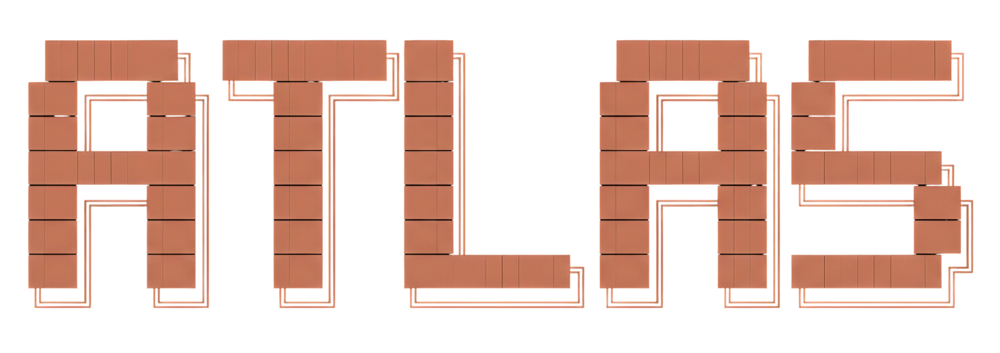

<p align="center">
  
</p>

<p align="center">
  <em>Atlas — Token optimizer plugin for OpenCode CLI</em>
</p>

Atlas is a plugin for OpenCode that reduces LLM token consumption through four coordinated modules: output compression, bash output compression, persistent session memory, and a suite of 18 specialized agents that delegate work efficiently instead of handling everything through a single generalist context.

**The problem:** Every token counts when you're chatting with AI all day. Those "Sure, I'd be happy to help!" pleasantries add up fast. That `npm install` output with 500 lines of progress bars? Pure token waste. And asking the model to re-explain your architecture for the 47th time? Criminal.

**The solution:** Four modules working together like a well-oiled token-saving machine. Echo makes responses terse (think caveman, but technically precise). Forge compresses bash output faster than you can say "deprecated dependency warning". Vault remembers everything so you never re-explain your project again. And the 18 specialized agents? They each handle exactly one thing and delegate everything else — no generalist writing essays to themselves.

> **Fun fact:** If Atlas had existed in 2023, it could have saved enough tokens to write War and Peace... approximately 12,847 times. I did the math. (Okay, it was an estimate. But it sounds impressive!)

## Token Savings — Real Numbers

I crunched the data so you don't have to:

| Module | Average Savings | Real-World Example |
|--------|----------------|-------------------|
| **Echo** | 40-75% output tokens | A verbose 500-word explanation becomes 125 words. You still get the answer, just without the fluff |
| **Forge** | 60-90% bash output | That `npm install` with 400 lines of progress bars? Compressed to 15 lines of actual useful info |
| **Agents** | 30-50% context tokens | 18 specialists with focused prompts beat one confused generalist every time |
| **Vault** | 25-40% repeat queries | "What's the DB schema again?" becomes instant recall instead of re-explanation |

**Bottom line:** Typical users see **45-65% reduction** in total token consumption. Atlas doesn't judge your workflow, it just optimizes it.

## Modules

### Echo

Output compression with three levels:

- **lite** — Removes filler, maintains complete structure
- **full** — Aggressive compression with technical abbreviations
- **ultra** — Caveman mode, absolute minimum tokens

Auto-Clarity detects critical contexts (security, irreversible operations) and automatically disables compression. Because some things shouldn't be abbreviated.

### Agents

18 specialized agents with dual prompts (echo/verbose). Each agent has a focused role and knows its exact boundaries — when to handle a task and when to delegate. Atlas orchestrates, subagents execute.

**Orchestration**

| Agent | Alias | Role |
|-------|-------|------|
| **Atlas** | — | Orchestrator, routes all tasks to specialists |

**Exploration & Research**

| Agent | Alias | Role |
|-------|-------|------|
| **Pathfinder** | `@tracker` | Codebase search, file discovery, symbol lookup |
| **Archivist** | `@keeper` | External docs, library references, API research |

**Design & Architecture**

| Agent | Alias | Role |
|-------|-------|------|
| **Elder** | `@sage` | Architecture decisions, complex debugging, strategy |
| **Artisan** | `@craftsman` | UI/UX, visual design, component styling |
| **Envoy** | `@contracts` | REST/GraphQL/gRPC API design, OpenAPI specs |

**Implementation**

| Agent | Alias | Role |
|-------|-------|------|
| **Mender** | `@repairman` | Code writing, tests, multi-file changes |
| **Inspector** | `@debugger` | Stack trace analysis, error diagnosis, targeted fixes |
| **Curator** | `@refactor` | Refactoring without behavior change |

**Quality & Review**

| Agent | Alias | Role |
|-------|-------|------|
| **Sentinel** | `@guard` | Security audit, OWASP, vulnerability detection |
| **Magistrate** | `@reviewer` | Code review, PR diffs, change impact analysis |
| **Tactician** | `@tester` | Test strategy, coverage gaps, unit/integration/e2e planning |
| **Alchemist** | `@optimizer` | Performance profiling, bottleneck identification, BigO |

**Infrastructure & Data**

| Agent | Alias | Role |
|-------|-------|------|
| **Herald** | `@deployer` | CI/CD pipelines, Dockerfiles, environment configs |
| **Lorekeeper** | `@analyst` | Schema design, migrations, query optimization |
| **Quartermaster** | `@deps` | Package upgrades, breaking changes, dependency audits |

**Communication**

| Agent | Alias | Role |
|-------|-------|------|
| **Scribe** | `@writer` | JSDoc, README, PR descriptions, changelogs |
| **Tribunal** | `@assembly` | Multi-LLM consensus for high-stakes decisions |

### Forge

Compression pipeline for bash tool output. Because nobody needs to read 400 lines of `npm install` progress bars:

- ANSI codes, timestamps, progress bar filtering
- Deduplication of repeated lines
- Redundancy cache (Jaccard similarity + FNV1a hashing)
- Intelligent truncation with error summary preservation

### Vault

Persistent memory between sessions via embedded SQLite (`bun:sqlite`, zero external dependencies). Because elephants never forget, and now neither does your IDE:

- Semantic search across session history (`mem_search`)
- Chronological session timeline (`mem_timeline`)
- Full observation retrieval (`mem_get_observation`)
- Manual and passive memory capture (`mem_save`)
- Context preservation across compaction events
- `<private>...</private>` tags for content that never persists

All 18 agents receive the Vault protocol via `system.transform` injection. They know to `mem_search` before acting and `mem_save` their key findings when done.

## TUI Commands

| Command | Effect |
|---------|--------|
| `/atlas-status` | Current configuration and module statistics |
| `/atlas-echo [lite\|full\|ultra]` | Enable echo compression at specified level |
| `/atlas-verbose` | Disable compression, switch to verbose mode |

## Installation

### Prerequisites

First, ensure Atlas loads as an OpenCode plugin by installing it in your config directory:

```bash
cd ~/.config/opencode
npm install @atlas-opencode/core
```

> **Why?** OpenCode loads plugins from its config directory's `node_modules`. Without this, Atlas is just a really organized folder, not a working plugin.

### Linux / macOS

```bash
bash <(curl -fsSL https://raw.githubusercontent.com/reactive-end/atlas/main/scripts/install.sh)
```

### Windows (PowerShell)

```powershell
iwr -useb https://raw.githubusercontent.com/reactive-end/atlas/main/scripts/install.ps1 | iex
```

## Configuration

Atlas reads `atlas.config.json` from `~/.config/opencode/`:

```jsonc
{
  "$schema": "https://unpkg.com/@atlas-opencode/core@latest/atlas.config.schema.json",
  "echo": {
    "enabled": true,
    "defaultLevel": "full",
    "autoClarityEnabled": true
  },
  "agents": {
    "enabled": true,
    "preset": "default",
    "defaultMode": "echo",
    "forceEchoOnAll": true
  },
  "forge": {
    "enabled": true,
    "maxLines": 200,
    "dedupMin": 3
  },
  "vault": {
    "enabled": true,
    "injectMemoryProtocol": true,
    "stripPrivateTags": true
  }
}
```

### Agent Presets

| Preset | Models | Use case |
|--------|--------|----------|
| `default` | gpt-5.4 + gpt-5.4-mini | Balanced cost and quality |
| `performance` | gpt-5.4 on all | Maximum quality |
| `economy` | gpt-5.4-mini on all | Maximum cost savings |
| `premium` | claude-opus-4.6 on all | Best quality, highest cost |

## Development

Yes, there are tests. Revolutionary, I know.

```bash
cd packages/core
npm install
npm run test        # Run all tests
npm run typecheck   # Type check
npm run check       # typecheck + tests
npm run build       # Compile
```

## Acknowledgments

Standing on the shoulders of giants (and token-saving wizards):

- [JuliusBrussee/caveman](https://github.com/JuliusBrussee/caveman) — The original **Echo** technique. Proved that AI can communicate like cavemen and still be understood. Unga bunga!
- [alvinunreal/oh-my-opencode-slim](https://github.com/alvinunreal/oh-my-opencode-slim) — The **Agents** system inspiration. Showed that specialized agents are better than one confused generalist.
- [claudioemmanuel/squeez](https://github.com/claudioemmanuel/squeez) — The **Forge** compression pipeline. Turns bash output into haikus (metaphorically speaking).
- [Gentleman-Programming/engram](https://github.com/Gentleman-Programming/engram) — The **Vault** memory system. Because elephants never forget, and now neither does your IDE. Love U Gentleman! ❤️

## License

MIT
